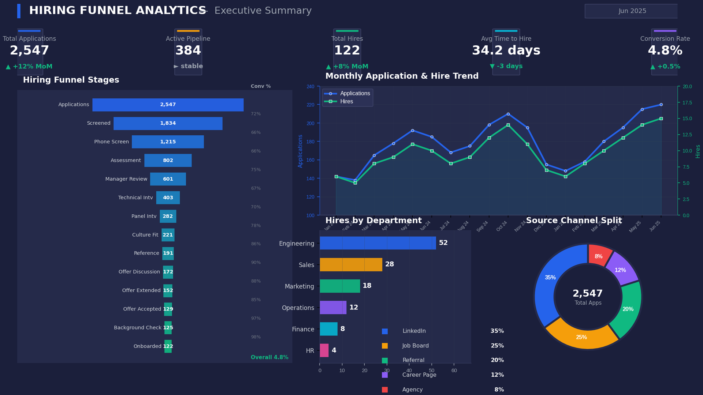
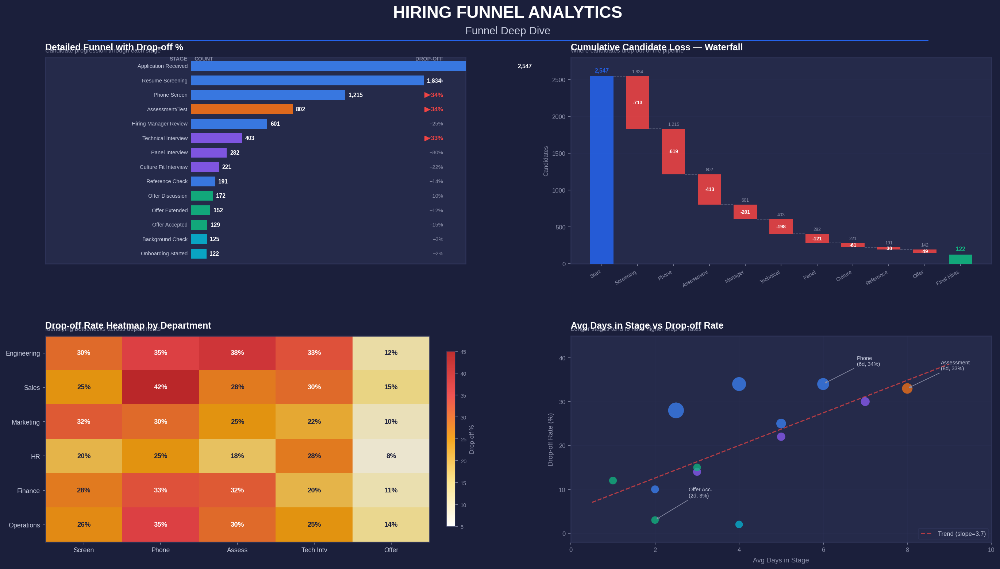
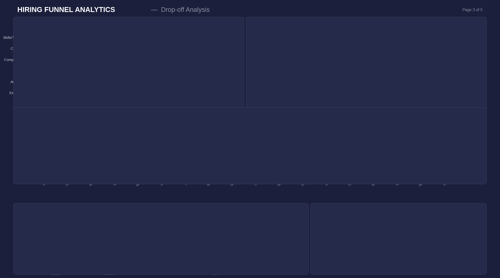
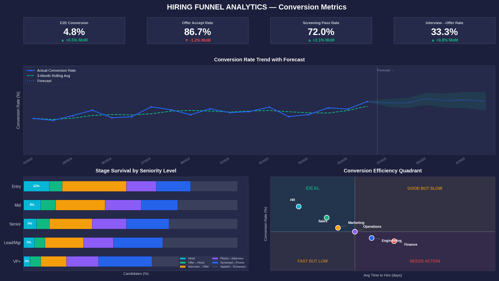
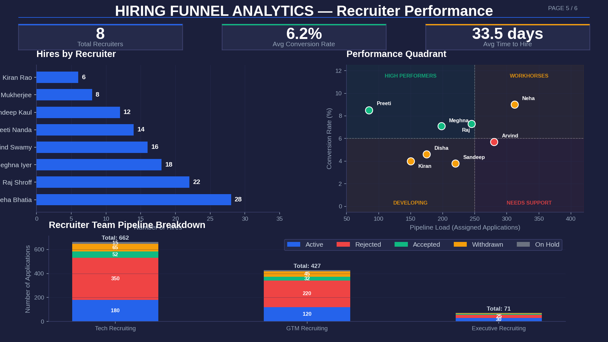
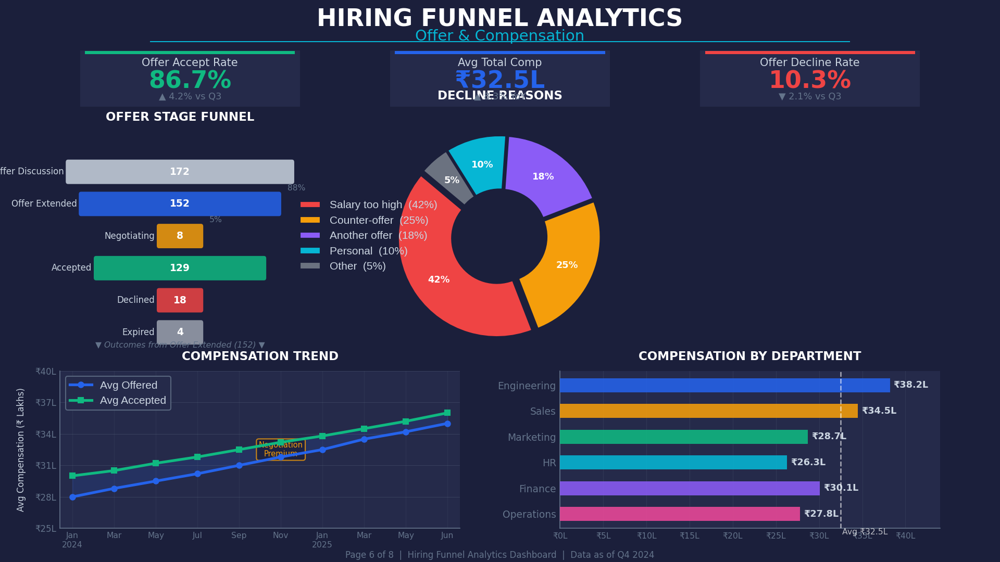
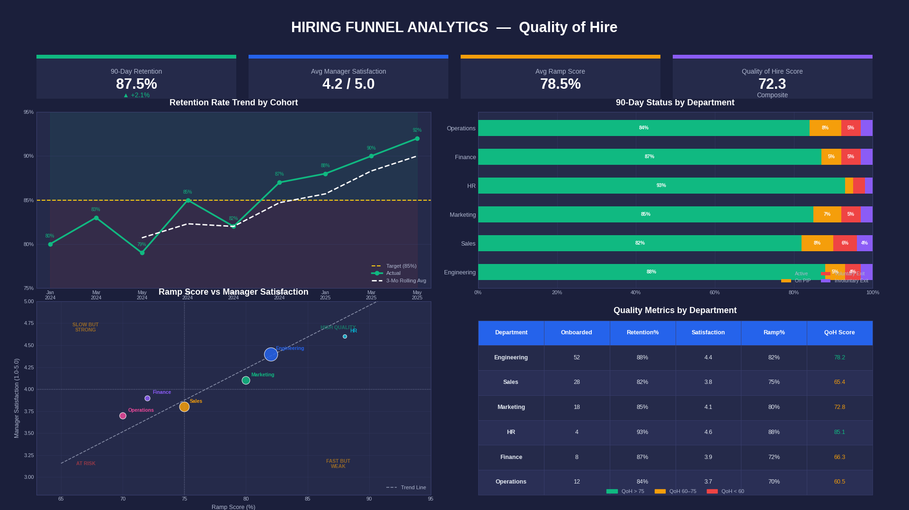

# 🎯 Hiring Funnel Analytics Dashboard

A comprehensive, production-grade analytics project that tracks, measures, and optimizes the complete hiring pipeline — from application to onboarding. Built with **SQL**, **Power BI**, and **DAX** to deliver actionable insights on KPI tracking, drop-off analysis, and conversion metrics.

---

## 📊 Project Overview

This project demonstrates end-to-end analytics engineering for a Talent Acquisition team. It models a realistic hiring funnel with **2,500+ applications** across **40 open positions** spanning **6 departments** over **18 months** of data.

### Key Capabilities

| Feature | Description |
|---|---|
| **SQL Data Warehouse** | Star schema with 5 dimension tables and 4 fact tables |
| **KPI Tracking** | 12+ KPI queries covering volume, rate, time, and quality metrics |
| **Drop-off Analysis** | 12 analytical queries identifying where and why candidates exit |
| **Conversion Metrics** | 12 queries measuring stage-to-stage and end-to-end conversion |
| **Power BI Dashboard** | 7-page interactive report with DAX measures |
| **Dashboard Visuals** | 7 professional dashboard mockups in `assets/` |
| **Stored Procedures** | Reusable parameterized queries for common analyses |

---

## 🖼️ Dashboard Visuals

### Page 1: Executive Summary


### Page 2: Funnel Deep Dive


### Page 3: Drop-off Analysis


### Page 4: Conversion Metrics


### Page 5: Recruiter Performance


### Page 6: Offer & Compensation


### Page 7: Quality of Hire


---

## 🏗️ Architecture

```
┌─────────────────────────────────────────────────────────┐
│                    POWER BI REPORT                       │
│  ┌──────────┬──────────┬──────────┬──────────┬────────┐ │
│  │Executive │ Funnel   │ Drop-off │Conversion│Recruit │ │
│  │Summary   │Deep Dive │Analysis  │Metrics   │Perf    │ │
│  └──────────┴──────────┴──────────┴──────────┴────────┘ │
│                    │ DAX Measures                        │
└────────────────────┼────────────────────────────────────┘
                     │
┌────────────────────┼────────────────────────────────────┐
│              SQL DATA WAREHOUSE                          │
│                    │                                      │
│  ┌─────────────────┼──────────────────────┐              │
│  │  DIMENSION TABLES                      │              │
│  │  • dim_candidate  • dim_job            │              │
│  │  • dim_recruiter  • dim_stage          │              │
│  │  • dim_date       • dim_rejection_reason│             │
│  └─────────────────┼──────────────────────┘              │
│                    │                                      │
│  ┌─────────────────┼──────────────────────┐              │
│  │  FACT TABLES                           │              │
│  │  • fact_application                    │              │
│  │  • fact_stage_transition               │              │
│  │  • fact_offer                          │              │
│  │  • fact_onboarding                     │              │
│  └────────────────────────────────────────┘              │
└──────────────────────────────────────────────────────────┘
```

---

## 📂 Project Structure

```
hiring-funnel-analytics/
│
├── sql/
│   ├── schema/
│   │   └── 01_create_database.sql          # Complete database schema
│   │
│   ├── sample-data/
│   │   └── 02_seed_sample_data.sql         # Realistic sample data (2,500+ records)
│   │
│   └── queries/
│       ├── 03_kpi_tracking.sql             # 12 KPI tracking queries
│       ├── 04_drop_off_analysis.sql        # 12 drop-off analysis queries
│       └── 05_conversion_metrics.sql       # 12 conversion metric queries
│
├── power-bi/
│   ├── dax/
│   │   └── hiring_funnel_measures.dax      # 40+ DAX measures
│   │
│   └── report-design/
│       └── report_design_spec.md           # 7-page Power BI report specification
│
├── docs/
│   ├── data_dictionary.md                  # Complete field-level documentation
│   └── kpi_definitions.md                  # Business definitions for all KPIs
│
├── .gitignore
└── README.md                               # This file
```

---

## 🗄️ Data Model

### Star Schema Design

The data warehouse follows a classic star schema pattern optimized for analytical queries:

### Dimension Tables

| Table | Description | Key Fields |
|---|---|---|
| `dim_candidate` | Candidate profiles & demographics | candidate_id, source_channel, years_of_experience |
| `dim_job` | Job requisition details | job_id, department, seniority_level, salary_range |
| `dim_recruiter` | Recruiter team information | recruiter_id, team, specialization |
| `dim_stage` | Hiring funnel stage definitions | stage_id, stage_name, stage_order, stage_category |
| `dim_date` | Calendar dimension | date_key, quarter, fiscal_year |
| `dim_rejection_reason` | Standardized exit reasons | reason_id, reason_category, reason_description |

### Fact Tables

| Table | Description | Grain | Key Metrics |
|---|---|---|---|
| `fact_application` | Core application tracking | One row per candidate-job application | application_date, status, pipeline_days |
| `fact_stage_transition` | Funnel stage movements | One row per stage transition | transition_date, outcome, days_in_stage |
| `fact_offer` | Offer details | One row per offer | base_salary, total_comp, offer_status |
| `fact_onboarding` | Post-hire onboarding | One row per hired candidate | satisfaction_score, ramp_score, 90-day status |

### Hiring Funnel Stages

```
Application Received (1)
        │  ↓
Resume Screening (2)
        │  ↓
Phone Screen (3)
        │  ↓
Assessment/Test (4)
        │  ↓
Hiring Manager Review (5)
        │  ↓
Technical Interview (6)
        │  ↓
Panel Interview (7)
        │  ↓
Culture Fit Interview (8)
        │  ↓
Reference Check (9)
        │  ↓
Offer Discussion (10)
        │  ↓
Offer Extended (11)
        │  ↓
Offer Accepted (12)
        │  ↓
Background Check (13)
        │  ↓
Onboarding Started (14)
```

---

## 📈 Key KPIs Tracked

### Volume Metrics
| KPI | Definition |
|---|---|
| Total Applications | Count of all applications received |
| Active Pipeline | Applications currently in process |
| Offers Extended | Count of formal offers sent |
| Hires Made | Candidates who accepted offers |

### Rate Metrics
| KPI | Definition | Target |
|---|---|---|
| Overall Conversion Rate | Hires / Applications | > 5% |
| Offer Acceptance Rate | Accepted / Offers Extended | > 75% |
| Screening Pass Rate | Phone Screen / Resume Screen | > 65% |
| 90-Day Retention Rate | Active at 90d / Onboarded | > 85% |
| Fill Rate | Hires / Headcount Required | > 80% |

### Time Metrics
| KPI | Definition | Target |
|---|---|---|
| Avg Time to Hire | Avg days from application to acceptance | < 35 days |
| Avg Days in Stage | Mean duration per funnel stage | Stage-specific |
| Avg Time to Offer | Days from application to offer date | < 28 days |

### Quality Metrics
| KPI | Definition | Target |
|---|---|---|
| Quality of Hire Score | Composite: Retention (40%) + Satisfaction (35%) + Ramp (25%) | > 70 |
| Manager Satisfaction | Post-hire manager rating (1-5) | > 4.0 |
| Ramp Score | Productivity % at 90 days | > 75% |

---

## 🔍 Drop-off Analysis Highlights

- **Stage-level drop-off rates** with benchmark comparison
- **Department × Stage heatmap** for bottleneck identification
- **Root cause analysis** with rejection reason breakdown
- **Time-correlated drop-off** — does delay increase exits?
- **Source channel withdrawal patterns**
- **No-show analysis** by interview type
- **Offer decline deep dive** with compensation correlation
- **Monthly trend analysis** with MoM change tracking

---

## 📊 Conversion Metrics Highlights

- **End-to-end conversion** (Application → Hire) by month
- **Stage-to-stage conversion** for all 14 funnel stages
- **Segmented conversion** by department, seniority, source channel
- **Referral vs. non-referral** conversion comparison
- **Recruiter conversion efficiency** ranking
- **Quarterly conversion trends** with QoQ change
- **Conversion efficiency index** — composite metric adjusting for time-to-hire
- **Offer funnel** — detailed offer-to-acceptance flow

---

## 🚀 Quick Start

### Prerequisites
- MySQL 8.0+ (or compatible RDBMS)
- Power BI Desktop (for report building)
- Git

### Setup

```bash
# Clone the repository
git clone https://github.com/YOUR_USERNAME/hiring-funnel-analytics.git
cd hiring-funnel-analytics

# Create the database and schema
mysql -u root -p < sql/schema/01_create_database.sql

# Load sample data
mysql -u root -p < sql/sample-data/02_seed_sample_data.sql

# Run individual analytical queries
mysql -u root -p < sql/queries/03_kpi_tracking.sql
mysql -u root -p < sql/queries/04_drop_off_analysis.sql
mysql -u root -p < sql/queries/05_conversion_metrics.sql
```

### Power BI Setup

1. Open Power BI Desktop
2. Connect to MySQL database: `hiring_funnel_analytics`
3. Import all dimension and fact tables
4. Configure relationships per the data model
5. Create DAX measures from `power-bi/dax/hiring_funnel_measures.dax`
6. Build report pages per `power-bi/report-design/report_design_spec.md`

---

## 🛠️ Technologies Used

| Technology | Purpose |
|---|---|
| **MySQL 8.0** | Data warehouse (star schema) |
| **SQL** | ETL, analytical queries, stored procedures |
| **Power BI** | Interactive dashboard & visualization |
| **DAX** | Calculated measures & time intelligence |
| **Git** | Version control |

---

## 📋 Skills Demonstrated

- ✅ **Data Modeling**: Star schema design with slowly changing dimensions
- ✅ **SQL Analytics**: Window functions, CTEs, subqueries, stored procedures
- ✅ **KPI Framework**: Business-aligned metric definitions with targets
- ✅ **Funnel Analysis**: Stage-by-stage conversion & drop-off tracking
- ✅ **Root Cause Analysis**: Rejection reason categorization & correlation
- ✅ **Power BI**: Multi-page report design with DAX measures
- ✅ **Data Visualization**: Chart type selection & conditional formatting
- ✅ **Documentation**: Comprehensive data dictionary & KPI definitions

---

## 📄 License

This project is licensed under the MIT License — see the [LICENSE](LICENSE) file for details.

---

## 🤝 Contributing

1. Fork the repository
2. Create your feature branch (`git checkout -b feature/amazing-feature`)
3. Commit your changes (`git commit -m 'Add amazing feature'`)
4. Push to the branch (`git push origin feature/amazing-feature`)
5. Open a Pull Request
